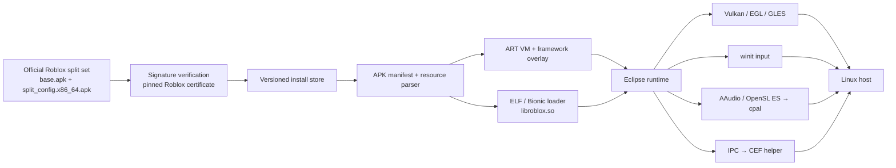

# Contributing to Eclipse

Focused bug reports and pull requests are welcome. Before opening a PR:

1. Keep changes scoped and explain the Android or client contract they preserve.
2. Add a regression test for loader, framework or runtime behavior where practical.
3. Run the formatting, Clippy and test commands in [Testing and CI](#testing-and-ci).
4. In compatibility reports, include your distribution, display server, GPU and driver, whether you use the Flatpak or a source build, the Roblox version that `eclipse run` prints, and relevant redacted logs.

Please do not attach APKs, client assets, account data, cookies, `google-play.json` or other authentication material to issues.

## How it works

Instead of booting a full Android system, Eclipse loads the Android x86-64 client into a native Linux process and implements or bridges only the platform surfaces the client uses.

| Part | How Eclipse provides it |
|---|---|
| Java side | The art_standalone ART VM with the Android Translation Layer framework and Eclipse's framework overlay |
| Native engine | Eclipse's own ELF loader with Bionic, JNI and NDK compatibility |
| Graphics | Vulkan WSI and EGL/GLES bridged to `ANativeWindow`, presented in a winit window through Vulkan |
| Input | Keyboard and mouse events from winit, delivered as Android input |
| Audio | AAudio and OpenSL ES bridged to cpal |
| Web content | An out-of-process, sandboxed CEF helper over shared memory and a Unix socket |
| Client files | The verified official APKs, never bundled or redistributed |



## Repository layout

```text
src/                             Core runtime, CLI and host bridges
src/apk/                         Binary manifest, resource-table and native-library handling
src/apk/signature.rs             Roblox APK signature verification (v2, v3 and v3.1 rotation)
src/apk/store.rs                 Versioned install store behind eclipse install and update
src/apk/apkcombo.rs              Account-free download of Roblox's release files behind eclipse update
src/apk/https.rs                 Shared HTTPS download rules: host allowlists, redirects, size limits
src/apk/play/                    Google Play client behind eclipse play-login and update --play
src/framework.rs, src/framework/ Android framework natives, registries and lifecycle
src/loader/                      ELF, Bionic, JNI, NDK, audio and graphics loading
src/webview/                     WebView IPC, shared memory and lifecycle
src/browser_launch.rs            roblox-player: and roblox:// link parsing
src/desktop_integration.rs       Browser Play handler registration
src/graphics.rs                  Host window, Vulkan presentation and input
crates/libm-shim/                apkenv-compatible no-std libm shim
crates/eclipse-webview/          Detached CEF WebView process
packaging/flatpak/               Flatpak manifest, desktop entries, AppStream metadata, icon, and the offline Cargo source list with its update and check scripts
shaders/                         Host compositor shaders and their SPIR-V builds
tools/framework-overlay/         Android framework patch sources and probes
tools/webview-dist/              Verified CEF payload packager
tests/                           Cross-component engine milestones
```

## Build from source

Building needs Rust 1.95 or newer, a C/C++ toolchain, `pkg-config`, and the ALSA, Fontconfig and FreeType development headers. On Debian or Ubuntu:

```bash
sudo apt install build-essential pkg-config libasound2-dev libfontconfig1-dev libfreetype6-dev
git clone https://github.com/Kuenec/Eclipse.git
cd Eclipse
cargo build --release --locked
```

Running a source build needs the Android runtime that the Flatpak bundles: art_standalone, bionic_translation, Android Translation Layer and libopensles-standalone installed on the host (the Flatpak manifest pins the commits), plus Eclipse's patched framework, which `tools/framework-overlay/patch-framework.sh` writes to `~/.cache/eclipse/framework-patched` by default. Eclipse looks for `libart.so` at `/usr/lib/art/libart.so`. These environment variables override the defaults:

| Variable | Purpose |
|---|---|
| `ECLIPSE_LIBART` | The `libart.so` to load |
| `ECLIPSE_ANDROID_FRAMEWORK_DIR` | The patched framework directory |
| `ECLIPSE_ART_BOOT_IMAGE` | The ART boot image |
| `ECLIPSE_APP_DATA_DIR` | The app data root, instead of `~/.local/share/eclipse/app-data` |
| `ECLIPSE_NATIVE_LIB_DIR` | Where native libraries are extracted, into `<dir>/<versionCode>`; Eclipse never removes anything there |
| `ECLIPSE_WEBVIEW_HELPER` | The `eclipse-webview` helper binary |
| `ECLIPSE_ROBLOX_APK` | An official APK or split-set directory for the tests that need the real client; they skip without it |

The WebView helper and its pinned CEF runtime stay out of the root Cargo graph. To assemble the complete payload in `dist/eclipse-linux-x86_64`:

```bash
cargo install export-cef-dir --version 152.2.0 --locked
./tools/webview-dist/package-webview.sh
```

The script verifies both the SHA-1 and SHA-256 digests of the pinned CEF archive, builds both binaries, checks the helper's `$ORIGIN` runtime path and smoke-tests the packaged helper. Tagged releases attach this payload as `eclipse-<tag>-linux-x86_64.tar.zst` with `SHA256SUMS`; it does not contain the Android runtime.

## Build the Flatpak locally

```bash
flatpak remote-add --user --if-not-exists flathub https://dl.flathub.org/repo/flathub.flatpakrepo
flatpak-builder --user --install-deps-from=flathub --install --force-clean \
  --state-dir=build/flatpak-builder build/flatpak-app packaging/flatpak/io.github.kuenec.Eclipse.yml
```

The manifest builds against the GNOME 51 SDK with the openjdk17 and rust-stable SDK extensions, which `--install-deps-from=flathub` installs from the Flathub remote of your user installation; the first command adds that remote if it is missing. Both working directories sit under `build/`, which the manifest leaves out of its source copy. The build is offline, so after changing any `Cargo.lock`, regenerate the vendored crate list with `packaging/flatpak/update-cargo-sources.sh` (it needs curl, sha256sum, uv and python3); the Flatpak workflow fails when the list is out of date.

## Testing and CI

The checks that GitHub Actions runs for the main crate can be run locally:

```bash
cargo fmt --all -- --check
cargo clippy --all-targets --locked -- -D warnings
cargo test --all-targets --locked
cargo build --release --locked
```

| Workflow | Runs on | Coverage |
|---|---|---|
| [CI](.github/workflows/ci.yml) | Pushes to main, pull requests | Formatting, Clippy for Eclipse and the libm shim, ShellCheck, actionlint, all targets and tests, the Rust 1.95 MSRV, the WebView helper's build, Clippy and tests against the pinned CEF archive, and an optimized release build with a CLI smoke test |
| [E2E](.github/workflows/e2e.yml) | Pushes to main, pull requests, weekly | Engine milestone tests, headless EGL/GLES rendering, real WSI binding, and the input and audio pipelines |
| [Security](.github/workflows/security.yml) | Pushes to main, pull requests, weekly | RustSec audits of Eclipse and the WebView helper, dependency review on pull requests, and CodeQL for Rust and Actions |
| [Release](.github/workflows/release.yml) | `v*.*.*` tags | Verified CEF payload, compressed Linux archive, checksums and the GitHub Release |
| [Flatpak](.github/workflows/flatpak.yml) | Changes to a `Cargo.lock`, `cargo-sources.json` or its check script, `v*.*.*` tags | Checks that `cargo-sources.json` vendors every locked crate; on tags, builds the Flatpak, publishes the signed repository to GitHub Pages and attaches `eclipse-x86_64.flatpak` to the release |

The public E2E job uses Mesa software rendering under Xvfb and does not require proprietary files. The full APK, ART and WebView milestone suite runs on a self-hosted runner labelled `eclipse-e2e` when the repository variable `ECLIPSE_FULL_E2E_ENABLED` is `true` and `ECLIPSE_E2E_APK_PATH` names an official APK or split-set directory on that runner. It does not run for pull requests.

## Releasing

Pushing a `vX.Y.Z` tag runs the Release and Flatpak workflows. The Flatpak workflow needs the repository secret `FLATPAK_GPG_PRIVATE_KEY` holding an ASCII-armored GPG private key without a passphrase, GitHub Pages set to deploy from GitHub Actions, and the `github-pages` environment (Settings, Environments) allowed to deploy from tags matching `v*.*.*`. It signs the build into the OSTree repository at `https://kuenec.github.io/Eclipse/repo/` and publishes the `.flatpakref` and `.flatpakrepo` files at the site root.

## Project scope

Eclipse is an independent, unofficial compatibility project. It is **not affiliated with, authorized by or endorsed by Roblox Corporation**. Roblox is a trademark of Roblox Corporation.

You are responsible for obtaining and using client files in accordance with the terms and laws that apply to you. Eclipse does not redistribute Roblox binaries or bypass account authentication.
