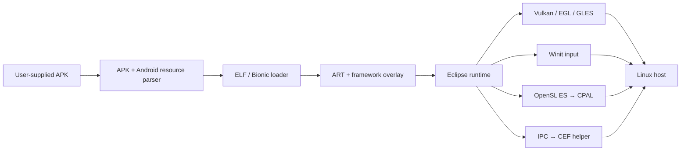

<div align="center">

# 🌘 Eclipse

### A native Rust runtime for the Android x86-64 Roblox client on Linux

Run the client through a focused Android compatibility layer — without booting a full Android VM.

[](https://github.com/Kuenec/Eclipse/actions/workflows/ci.yml)
[](https://github.com/Kuenec/Eclipse/actions/workflows/e2e.yml)
[](https://github.com/Kuenec/Eclipse/actions/workflows/security.yml)
[](https://www.rust-lang.org/)
[](https://kernel.org/)
[](LICENSE)
[](https://github.com/Kuenec/Eclipse/stargazers)

[Get started](#quick-start) · [How it works](#how-it-works) · [Configuration](#configuration) · [Contribute](#contributing)

</div>

> [!IMPORTANT]
> Eclipse is experimental and under active development. Compatibility changes quickly, and the runtime is not yet a drop-in replacement for a mature Android environment.

## Why Eclipse?

Traditional solutions run an entire Android guest. Eclipse takes a narrower approach: it loads the Android x86-64 client directly and implements or bridges only the platform surfaces it needs.

| | Eclipse approach |
|---|---|
| **Runtime** | Native Rust process on Linux |
| **Android layer** | Focused Bionic, JNI, NDK and framework compatibility |
| **Graphics** | Host Vulkan or EGL/GLES, native window integration |
| **Audio & input** | OpenSL ES and Android input bridged to host APIs |
| **Web content** | Isolated out-of-process CEF helper |
| **Client files** | Always supplied by the user; never redistributed |

### What is already here

- ELF loading, relocation, symbol resolution and Bionic compatibility shims
- ART boot planning and Android framework overlays
- Native Linux graphics, audio, input and window integration
- APK manifest/resource parsing and x86-64 native library extraction
- Vulkan WSI, EGL/GLES2 and `ANativeWindow` bridging
- Shared-memory, Unix-socket WebView transport with a detached CEF helper
- Hundreds of unit, integration, loader and runtime contract tests

## Quick start

### Requirements

- Linux on x86-64 with X11 or Wayland
- Rust **1.95** or newer
- A C/C++ toolchain, `pkg-config`, ALSA development headers and host graphics drivers
- A compatible Android x86-64 Roblox APK that you obtained yourself
- The ART/framework runtime assets expected by Eclipse for a full client boot

On Ubuntu or Debian, the core build dependencies can be installed with:

```bash
sudo apt update
sudo apt install build-essential pkg-config libasound2-dev libegl1 libgles2
```

Build Eclipse from source:

```bash
git clone https://github.com/Kuenec/Eclipse.git
cd Eclipse
cargo build --release --locked
```

Then inspect the CLI and launch a user-supplied APK:

```bash
./target/release/eclipse help
./target/release/eclipse run /path/to/Roblox-x86_64.apk
```

To make Roblox's website Play button launch Eclipse on Linux, register the
`roblox-player:` handler once while supplying your APK:

```bash
./target/release/eclipse install-url-handler /path/to/Roblox-x86_64.apk
```

The browser URL is parsed by Eclipse, its authentication ticket is discarded,
and only the validated Roblox place ID is delivered to the Android client.

Eclipse can also fetch from a URL you explicitly configure. It never ships, mirrors or hard-codes a Roblox APK source.

## Configuration

The default configuration lives at `~/.config/eclipse/config.json`. Run the following command to print its effective path and merged values:

```bash
cargo run --release -- config
```

A minimal example:

```json
{
  "graphics_optimization_mode": "balanced",
  "enable_gamemode": true,
  "touch_mode": "off",
  "apk_url": null,
  "apk_sha256": null,
  "auto_fetch_missing": false,
  "webview_allow_unsandboxed": false,
  "fflags": {}
}
```

If you opt into fetching, set both `apk_url` and its `apk_sha256` whenever possible. The `ECLIPSE_APK_URL` and `ECLIPSE_APK_CACHE_DIR` environment variables are available for automation.

## How it works



The repository is split by responsibility:

```text
src/                         Core runtime, loader and host bridges
src/apk/                     Binary manifest and resource-table parsing
src/loader/                  ELF, Bionic, JNI, NDK and graphics loading
src/webview/                 WebView IPC, shared memory and lifecycle
crates/libm-shim/            apkenv-compatible no-std libm shim
crates/eclipse-webview/      Detached CEF WebView process
tools/framework-overlay/     Android framework patch sources and probes
tools/webview-dist/          Verified CEF payload packager
tests/                       Cross-component engine milestones
```

## Testing and CI

The same checks used by GitHub Actions can be run locally:

```bash
cargo fmt --all -- --check
cargo clippy --all-targets --locked -- -D warnings
cargo test --all-targets --locked
cargo build --release --locked
```

| Workflow | Coverage |
|---|---|
| [CI](.github/workflows/ci.yml) | Formatting, Clippy, ShellCheck, actionlint, all targets/tests, Rust 1.95 MSRV and release artifact |
| [E2E](.github/workflows/e2e.yml) | Headless EGL/GLES rendering, real WSI binding, input and audio pipelines |
| [Security](.github/workflows/security.yml) | RustSec, dependency review and CodeQL for Rust and Actions |
| [Release](.github/workflows/release.yml) | Verified CEF payload, compressed Linux archive, checksums and GitHub Release |

The public E2E job uses Mesa software rendering under Xvfb and does not require proprietary files. A provisioned self-hosted runner can enable the full APK + ART + WebView milestone suite with the `ECLIPSE_FULL_E2E_ENABLED` repository variable.

## Complete WebView payload

The detached WebView helper and its pinned CEF runtime are intentionally kept out of the root Cargo graph. To assemble the complete Linux payload:

```bash
cargo install download-cef --version 2.3.2 --locked
./tools/webview-dist/package-webview.sh
```

The packaging script verifies both SHA-1 and SHA-256 for the pinned CEF archive, builds both binaries, checks the `$ORIGIN` runtime layout and performs a packaged-helper smoke test. Tagged releases run this pipeline automatically.

## Contributing

Focused bug reports and pull requests are welcome. Before opening a PR:

1. Keep changes scoped and explain the Android/client contract they preserve.
2. Add a regression test for loader, framework or runtime behavior where practical.
3. Run the formatting, Clippy and test commands from the section above.
4. Include your distribution, display server, graphics stack, APK version and relevant redacted logs in compatibility reports.

Please do not attach APKs, client assets, account data, cookies or authentication material to issues.

## Project scope and disclaimer

Eclipse is an independent, unofficial compatibility project. It is **not affiliated with, authorized by or endorsed by Roblox Corporation**. Roblox is a trademark of Roblox Corporation.

You are responsible for obtaining and using client files in accordance with the terms and laws that apply to you. Eclipse does not redistribute Roblox binaries or bypass account authentication.

## License

Eclipse is released under the [MIT License](LICENSE).

<div align="center">

Built with Rust, stubbornness and a healthy respect for ABI boundaries.

</div>
