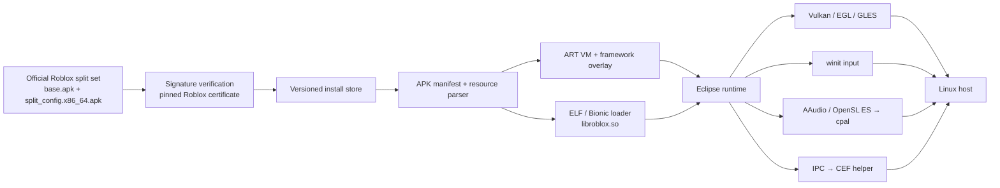

<div align="center">

# 🌘 Eclipse

### Run the official Android Roblox client on Linux

Eclipse is a native Rust runtime for the Android x86-64 Roblox client. It runs the client on your Linux desktop through a focused Android compatibility layer instead of a full Android VM.

[](https://github.com/Kuenec/Eclipse/releases/latest)
[](https://github.com/Kuenec/Eclipse/actions/workflows/flatpak.yml)
[](https://github.com/Kuenec/Eclipse/actions/workflows/ci.yml)
[](https://github.com/Kuenec/Eclipse/actions/workflows/e2e.yml)
[](https://github.com/Kuenec/Eclipse/actions/workflows/security.yml)
[](https://www.rust-lang.org/)
[](https://kernel.org/)
[](LICENSE)
[](https://github.com/Kuenec/Eclipse/stargazers)

[Install](#install) · [Get Roblox](#get-roblox) · [Play](#play) · [Settings](#settings) · [For developers](#for-developers)

</div>

> [!IMPORTANT]
> Eclipse is experimental and under active development. Compatibility changes quickly, and it is not yet a drop-in replacement for a mature Android environment.

## Install

Eclipse is distributed as a prebuilt Flatpak. You do not need Rust or any build tools to use it.

You need:

- Linux on x86-64 with a Wayland or X11 desktop session
- A graphics driver with Vulkan support
- [Flatpak](https://flatpak.org/setup/)

Install Eclipse together with its update source:

```bash
flatpak install --user https://kuenec.github.io/Eclipse/io.github.kuenec.Eclipse.flatpakref
```

This installs the app from Eclipse's GPG-signed Flatpak repository and offers to keep that repository as a remote named `eclipse`. The GNOME 51 runtime that Eclipse uses comes from Flathub; if Flathub is not set up yet, Flatpak offers to add it. Software centers with Flatpak support, such as GNOME Software and KDE Discover, can also open the `.flatpakref` file.

New Eclipse versions arrive with your other Flatpak updates:

```bash
flatpak update
```

Two other ways to install:

- Add only the repository and install from it. Flathub must already be configured for your user, because the runtime comes from there; the first command below does that if needed.

  ```bash
  flatpak remote-add --user --if-not-exists flathub https://dl.flathub.org/repo/flathub.flatpakrepo
  flatpak remote-add --user --if-not-exists eclipse https://kuenec.github.io/Eclipse/io.github.kuenec.Eclipse.flatpakrepo
  flatpak install --user eclipse io.github.kuenec.Eclipse
  ```

- Download `eclipse-x86_64.flatpak` from the [latest release](https://github.com/Kuenec/Eclipse/releases/latest) and run `flatpak install --user eclipse-x86_64.flatpak`. The bundle points at the same repository, so `flatpak update` keeps Eclipse current afterwards.

The rest of this README writes commands as `eclipse <command>`. With the Flatpak, type `flatpak run io.github.kuenec.Eclipse <command>` instead, or define an alias in your shell:

```bash
alias eclipse='flatpak run io.github.kuenec.Eclipse'
```

## Get Roblox

Eclipse does not include Roblox. It installs the official Android client into its own data directory and runs only files signed by Roblox Corporation, as described in [What Eclipse checks and what it never does](#what-eclipse-checks-and-what-it-never-does).

### Install the client from APK files

Eclipse needs two files from Roblox's official Android release: `base.apk` and `split_config.x86_64.apk`, which holds the x86-64 engine. `eclipse install` accepts any of these:

- the two APK files, under any file names
- a directory that holds them as `base.apk` and `split_config.x86_64.apk`
- an `.apks`, `.xapk` or `.apkm` bundle that contains them (encrypted bundles, such as newer `.apkm` files, are not supported)
- a single APK that already contains the x86-64 engine

```bash
eclipse install ~/Downloads/base.apk ~/Downloads/split_config.x86_64.apk
eclipse install ~/Downloads/roblox.apks
```

The Flatpak can read your Downloads folder, so keep the files there. To let it read another folder, grant access once, for example with `flatpak override --user --filesystem=~/Games/roblox:ro io.github.kuenec.Eclipse`.

Eclipse verifies the signature of every file before it installs anything. If a file is not Roblox's official, unmodified release, the install stops and the client you already have stays in place.

### Keep the client updated

`eclipse update` downloads the newest official Roblox client, verifies it and installs it. Today it downloads from Google Play, so it needs a one-time `eclipse play-login` with your own Google account; the command explains each step. Once you are signed in, starting Eclipse checks for a new Roblox version at most every six hours, and if that check fails, Eclipse starts the version you already have.

> [!WARNING]
> Google's terms do not allow unofficial Play clients, and Google may restrict an account that uses one. Use a secondary Google account, not your main one.

## Play

Start **Eclipse** from your application menu. To see Eclipse's messages, start it from a terminal instead:

```bash
flatpak run io.github.kuenec.Eclipse run
```

`flatpak run io.github.kuenec.Eclipse` without a command prints the help. `eclipse run <PATH>` runs an APK file, or a directory that holds the split set, without installing it; the same signature check applies.

### Browser Play button

The Flatpak registers Eclipse for `roblox-player:` and `roblox://` links, so the Play button on the Roblox website opens the experience in Eclipse. If another app already handles these links, make Eclipse the default by running this outside the sandbox:

```bash
xdg-mime default io.github.kuenec.Eclipse.UrlHandler.desktop x-scheme-handler/roblox-player x-scheme-handler/roblox
```

Outside the Flatpak, run `eclipse install-url-handler` once to register the binary you are running.

Eclipse reads only the place ID from the link. It discards the launch ticket that `roblox-player:` links carry, and the client opens the place with the account signed in inside it. Browser launches start the installed client without checking for a Roblox update first.

### Mouse and keyboard

- Over the game, Eclipse hides the desktop cursor, because Roblox draws its own cursor as it does on Android. The desktop cursor comes back over web pages the client opens, such as sign-in pages.
- Hold the right mouse button to turn the camera. The cursor stays where it is while you drag and is at the same spot when you release the button.
- When the game locks the mouse, as in shift lock and first person, Eclipse locks the pointer too.
- On Wayland, Eclipse uses the compositor's pointer lock. On X11, which has no pointer lock, it confines the cursor to the window and moves it back to where the lock began.
- Switching to another window releases the lock.

This applies with the default `touch_mode` of `"off"`.

## Settings

`eclipse config` prints the path of the configuration file and the values in effect. The file is optional plain JSON, and keys you leave out keep their defaults. With the Flatpak it is `~/.var/app/io.github.kuenec.Eclipse/config/eclipse/config.json`; otherwise it is `~/.config/eclipse/config.json`. Changes take effect the next time you start Eclipse.

```json
{
  "graphics_optimization_mode": "performance",
  "touch_mode": "off",
  "fflags": {}
}
```

| Key | Default | Effect |
|---|---|---|
| `fflags` | `{}` | Fast Flags for the client. Eclipse writes exactly these to the client's `ClientAppSettings.json` and adds none of its own; when this is empty, it writes no such file. |
| `graphics_optimization_mode` | `"balanced"` | `"performance"` pins Eclipse to one logical CPU per physical core on CPUs with SMT and at least eight physical cores. `"quality"` and `"balanced"` currently behave the same. |
| `touch_mode` | `"off"` | `"off"` delivers the mouse to the game as a desktop mouse. `"on"` and `"fake-off"` deliver clicks as touch input and keep the desktop cursor visible. `"on"` also tells the client that the device has a touchscreen and is not a PC; `"off"` and `"fake-off"` report a PC without a touchscreen. |
| `webview_allow_unsandboxed` | `false` | Outside the Flatpak only: lets the WebView helper run without Chromium's sandbox when the host cannot provide one. The Flatpak always sandboxes it. |
| `webview_helper_path` | `null` | Overrides the path of the `eclipse-webview` helper. It is only needed for source builds where the helper is neither next to the `eclipse` binary nor in `crates/eclipse-webview/target/`. Leave it unset in the Flatpak. |

`eclipse config` also lists keys such as `use_opengl`, `enable_gamemode` and `discord_rpc_enabled`. Eclipse accepts them but does not act on them yet.

## Where Eclipse keeps its files

These paths assume the default XDG base directories.

| What | Flatpak, under `~/.var/app/io.github.kuenec.Eclipse/` | Outside the Flatpak |
|---|---|---|
| Settings | `config/eclipse/config.json` | `~/.config/eclipse/config.json` |
| Installed Roblox client (current and previous version) | `data/eclipse/roblox/<versionCode>/` | `~/.local/share/eclipse/roblox/<versionCode>/` |
| Game data, WebView profile and staged Fast Flags | `data/eclipse/app-data/` | `~/.local/share/eclipse/app-data/` |
| Google Play sign-in, readable only by you | `data/eclipse/google-play.json` | `~/.local/share/eclipse/google-play.json` |
| Extracted native libraries | `cache/eclipse/native-libs/` | `~/.cache/eclipse/native-libs/` |

To remove Eclipse, the installed Roblox client and all of this data:

```bash
flatpak uninstall --user --delete-data io.github.kuenec.Eclipse
flatpak remote-delete --user eclipse
```

Run the second command only if you added the `eclipse` remote, either by keeping it when you installed from the `.flatpakref` or with `flatpak remote-add`.

## What Eclipse checks and what it never does

- Every APK that Eclipse installs or runs must carry a valid APK Signature Scheme v2 signature from Roblox Corporation's certificate, whose SHA-256 digest is `44932ea35a17a267372d71b54d1a0cb3da0dca5113e94406ae2fe18090ba1477`. If the base APK also has a v3 or v3.1 signature, its key-rotation proof must start at that certificate. A file changed after signing fails the check. Eclipse checks at install time and again at every launch.
- Eclipse does not modify or patch the client, and it does not host, mirror or redistribute it.
- Eclipse sets no Fast Flags of its own. The client's `ClientAppSettings.json` comes only from the `fflags` in your settings.
- When the client asks the Android package manager for its signing certificates, Eclipse reports the real certificates from the verified APK.
- Browser launches hand only the place ID to the client.

## Troubleshooting

- Start Eclipse from a terminal to see what it is doing. For more detail, run `flatpak run --env=RUST_LOG=debug io.github.kuenec.Eclipse run`.
- "Roblox is not installed" means Eclipse has no client yet. Install one with `eclipse install`, or with `eclipse play-login` followed by `eclipse update`.
- A signature error means the files are not Roblox's official, unmodified release. Get a clean copy of the files and install again.
- To report a problem, see [Contributing](#contributing) for what to include.

## For developers

### How it works

Instead of booting a full Android system, Eclipse loads the Android x86-64 client into a native Linux process and implements or bridges only the platform surfaces the client uses.

| Part | How Eclipse provides it |
|---|---|
| Java side | The art_standalone ART VM with the Android Translation Layer framework and Eclipse's framework overlay |
| Native engine | Eclipse's own ELF loader with Bionic, JNI and NDK compatibility |
| Graphics | Vulkan WSI and EGL/GLES bridged to `ANativeWindow`, presented in a winit window through Vulkan |
| Input | Keyboard and mouse events from winit, delivered as Android input |
| Audio | AAudio and OpenSL ES bridged to cpal |
| Web content | An out-of-process, sandboxed CEF helper over shared memory and a Unix socket |
| Client files | The verified official APKs, never bundled or redistributed |


```mermaid
flowchart LR
    APKs["Official Roblox split set<br/>base.apk + split_config.x86_64.apk"] --> Verify["Signature verification<br/>pinned Roblox certificate"]
    Verify --> Store["Versioned install store"]
    Store --> Parser["APK manifest + resource parser"]
    Parser --> ART["ART VM + framework overlay"]
    Parser --> Loader["ELF / Bionic loader<br/>libroblox.so"]
    ART --> Runtime["Eclipse runtime"]
    Loader --> Runtime
    Runtime --> Graphics["Vulkan / EGL / GLES"]
    Runtime --> Input["winit input"]
    Runtime --> Audio["AAudio / OpenSL ES → cpal"]
    Runtime --> WebView["IPC → CEF helper"]
    Graphics --> Linux["Linux host"]
    Input --> Linux
    Audio --> Linux
    WebView --> Linux
```

### Repository layout

```text
src/                             Core runtime, CLI and host bridges
src/apk/                         Binary manifest, resource-table and native-library handling
src/apk/signature.rs             Roblox APK signature verification (v2, v3 and v3.1 rotation)
src/apk/store.rs                 Versioned install store behind eclipse install and update
src/apk/play/                    Google Play client behind eclipse play-login and update
src/framework.rs, src/framework/ Android framework natives, registries and lifecycle
src/loader/                      ELF, Bionic, JNI, NDK, audio and graphics loading
src/webview/                     WebView IPC, shared memory and lifecycle
src/browser_launch.rs            roblox-player: and roblox:// link parsing
src/desktop_integration.rs       Browser Play handler registration
src/graphics.rs                  Host window, Vulkan presentation and input
crates/libm-shim/                apkenv-compatible no-std libm shim
crates/eclipse-webview/          Detached CEF WebView process
packaging/flatpak/               Flatpak manifest, desktop entries, AppStream metadata, icon, and the offline Cargo source list with its update and check scripts
shaders/                         Host compositor shaders and their SPIR-V builds
tools/framework-overlay/         Android framework patch sources and probes
tools/webview-dist/              Verified CEF payload packager
tests/                           Cross-component engine milestones
```

### Build from source

Building needs Rust 1.95 or newer, a C/C++ toolchain, `pkg-config`, and the ALSA, Fontconfig and FreeType development headers. On Debian or Ubuntu:

```bash
sudo apt install build-essential pkg-config libasound2-dev libfontconfig1-dev libfreetype6-dev
git clone https://github.com/Kuenec/Eclipse.git
cd Eclipse
cargo build --release --locked
```

Running a source build needs the Android runtime that the Flatpak bundles: art_standalone, bionic_translation, Android Translation Layer and libopensles-standalone installed on the host (the Flatpak manifest pins the commits), plus Eclipse's patched framework, which `tools/framework-overlay/patch-framework.sh` writes to `~/.cache/eclipse/framework-patched` by default. Eclipse looks for `libart.so` at `/usr/lib/art/libart.so`. These environment variables override the defaults:

| Variable | Purpose |
|---|---|
| `ECLIPSE_LIBART` | The `libart.so` to load |
| `ECLIPSE_ANDROID_FRAMEWORK_DIR` | The patched framework directory |
| `ECLIPSE_ART_BOOT_IMAGE` | The ART boot image |
| `ECLIPSE_APP_DATA_DIR` | The app data root, instead of `~/.local/share/eclipse/app-data` |
| `ECLIPSE_NATIVE_LIB_DIR` | Where native libraries are extracted |
| `ECLIPSE_WEBVIEW_HELPER` | The `eclipse-webview` helper binary |
| `ECLIPSE_ROBLOX_APK` | An official APK or split-set directory for the tests that need the real client; they skip without it |

The WebView helper and its pinned CEF runtime stay out of the root Cargo graph. To assemble the complete payload in `dist/eclipse-linux-x86_64`:

```bash
cargo install export-cef-dir --version 152.2.0 --locked
./tools/webview-dist/package-webview.sh
```

The script verifies both the SHA-1 and SHA-256 digests of the pinned CEF archive, builds both binaries, checks the helper's `$ORIGIN` runtime path and smoke-tests the packaged helper. Tagged releases attach this payload as `eclipse-<tag>-linux-x86_64.tar.zst` with `SHA256SUMS`; it does not contain the Android runtime.

### Build the Flatpak locally

```bash
flatpak remote-add --user --if-not-exists flathub https://dl.flathub.org/repo/flathub.flatpakrepo
flatpak-builder --user --install-deps-from=flathub --install --force-clean \
  --state-dir=build/flatpak-builder build/flatpak-app packaging/flatpak/io.github.kuenec.Eclipse.yml
```

The manifest builds against the GNOME 51 SDK with the openjdk17 and rust-stable SDK extensions, which `--install-deps-from=flathub` installs from the Flathub remote of your user installation; the first command adds that remote if it is missing. Both working directories sit under `build/`, which the manifest leaves out of its source copy. The build is offline, so after changing any `Cargo.lock`, regenerate the vendored crate list with `packaging/flatpak/update-cargo-sources.sh` (it needs curl, sha256sum, uv and python3); the Flatpak workflow fails when the list is out of date.

### Testing and CI

The checks that GitHub Actions runs for the main crate can be run locally:

```bash
cargo fmt --all -- --check
cargo clippy --all-targets --locked -- -D warnings
cargo test --all-targets --locked
cargo build --release --locked
```

| Workflow | Runs on | Coverage |
|---|---|---|
| [CI](.github/workflows/ci.yml) | Pushes to main, pull requests | Formatting, Clippy for Eclipse and the libm shim, ShellCheck, actionlint, all targets and tests, the Rust 1.95 MSRV, the WebView helper's build, Clippy and tests against the pinned CEF archive, and an optimized release build with a CLI smoke test |
| [E2E](.github/workflows/e2e.yml) | Pushes to main, pull requests, weekly | Engine milestone tests, headless EGL/GLES rendering, real WSI binding, and the input and audio pipelines |
| [Security](.github/workflows/security.yml) | Pushes to main, pull requests, weekly | RustSec audits of Eclipse and the WebView helper, dependency review on pull requests, and CodeQL for Rust and Actions |
| [Release](.github/workflows/release.yml) | `v*.*.*` tags | Verified CEF payload, compressed Linux archive, checksums and the GitHub Release |
| [Flatpak](.github/workflows/flatpak.yml) | Changes to a `Cargo.lock`, `cargo-sources.json` or its check script, `v*.*.*` tags | Checks that `cargo-sources.json` vendors every locked crate; on tags, builds the Flatpak, publishes the signed repository to GitHub Pages and attaches `eclipse-x86_64.flatpak` to the release |

The public E2E job uses Mesa software rendering under Xvfb and does not require proprietary files. The full APK, ART and WebView milestone suite runs on a self-hosted runner labelled `eclipse-e2e` when the repository variable `ECLIPSE_FULL_E2E_ENABLED` is `true` and `ECLIPSE_E2E_APK_PATH` names an official APK or split-set directory on that runner. It does not run for pull requests.

### Releasing

Pushing a `vX.Y.Z` tag runs the Release and Flatpak workflows. The Flatpak workflow needs the repository secret `FLATPAK_GPG_PRIVATE_KEY` holding an ASCII-armored GPG private key without a passphrase, GitHub Pages set to deploy from GitHub Actions, and the `github-pages` environment (Settings, Environments) allowed to deploy from tags matching `v*.*.*`. It signs the build into the OSTree repository at `https://kuenec.github.io/Eclipse/repo/` and publishes the `.flatpakref` and `.flatpakrepo` files at the site root.

## Contributing

Focused bug reports and pull requests are welcome. Before opening a PR:

1. Keep changes scoped and explain the Android or client contract they preserve.
2. Add a regression test for loader, framework or runtime behavior where practical.
3. Run the formatting, Clippy and test commands from [Testing and CI](#testing-and-ci).
4. In compatibility reports, include your distribution, display server, GPU and driver, whether you use the Flatpak or a source build, the Roblox version that `eclipse run` prints, and relevant redacted logs.

Please do not attach APKs, client assets, account data, cookies, `google-play.json` or other authentication material to issues.

## Contributors

- [Yoshi-OOF](https://github.com/Yoshi-OOF) — framework, CI, and browser launch improvements

## Project scope and disclaimer

Eclipse is an independent, unofficial compatibility project. It is **not affiliated with, authorized by or endorsed by Roblox Corporation**. Roblox is a trademark of Roblox Corporation.

You are responsible for obtaining and using client files in accordance with the terms and laws that apply to you. Eclipse does not redistribute Roblox binaries or bypass account authentication.

## License

Eclipse is released under the [MIT License](LICENSE).

<div align="center">

Built with Rust, stubbornness and a healthy respect for ABI boundaries.

</div>
