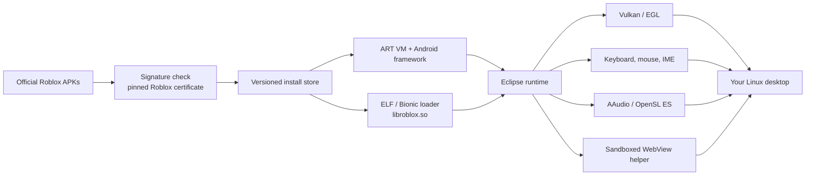

<div align="center">

# 🌘 Eclipse

**Play the official Roblox client on Linux.**

[](https://github.com/Kuenec/Eclipse/releases/latest)
[](https://github.com/Kuenec/Eclipse/actions/workflows/ci.yml)
[](https://github.com/Kuenec/Eclipse/actions/workflows/e2e.yml)
[](https://github.com/Kuenec/Eclipse/actions/workflows/security.yml)
[](https://www.rust-lang.org/)
[](https://kernel.org/)
[](LICENSE)
[](https://github.com/Kuenec/Eclipse/stargazers)

</div>

Eclipse runs Roblox's official Android x86-64 client natively on Linux, with a small Android compatibility layer instead of a full Android VM. It is a fully open-source alternative to [Sober](https://sober.vinegarhq.org), which is closed source, and it is verified to work in-game. Eclipse is not affiliated with Roblox Corporation.

## Install

```bash
flatpak install --user https://kuenec.github.io/Eclipse/io.github.kuenec.Eclipse.flatpakref
```

You need an x86-64 Linux desktop (Wayland or X11) and a Vulkan driver. Eclipse takes about 100 MB on top of the shared GNOME runtime and updates with `flatpak update`. A [standalone bundle](https://github.com/Kuenec/Eclipse/releases/latest) is also available; it needs GTK 4.10+ and WebKitGTK 6.0 (2.42+) from your distribution for sign-in and web pages, and xdg-desktop-portal with a GTK, GNOME or KDE backend for links and notifications.

## Features

- **No setup.** Eclipse downloads and updates Roblox by itself, with no account needed.
- **Official and unmodified.** Only files signed by Roblox run, and the game is never patched.
- **Plays like the desktop client.** Mouse lock, clipboard, input methods, controllers and F11 or Alt+Enter fullscreen.
- **Uncapped frame rate.** Roblox's own frame rate menu, up to 240 FPS on any monitor.
- **Browser Play button.** `roblox://` and `roblox-player:` links open in Eclipse, which closes when you leave that experience.
- **Sandboxed** in Flatpak, with no telemetry.

## Usage

Start **Eclipse** from your app menu. From a terminal, use `flatpak run io.github.kuenec.Eclipse <command>`:

| Command | What it does |
|---|---|
| `run` | Start Roblox (the default from the app menu) |
| `run --check-update` | Check for a newer Roblox, then start it |
| `open <link>` | Start Roblox at a game, server, private-server, friend or share link, or a place ID |
| `update` | Check for a newer Roblox now |
| `rollback` | Go back to the Roblox version before the current one, if Eclipse still keeps it |
| `install <files>` | Install Roblox from your own `base.apk` + `split_config.x86_64.apk`, or an `.apks`/`.xapk` bundle |
| `config` | Show the settings file path, the values in effect and any problems in the file |
| `storage` | Show the disk space Eclipse uses; `storage --clean` empties the caches and old logs |

Sign-in and other Roblox web pages open inside the game window on Wayland and as a window of their own on X11.

## Settings

Settings live in `~/.var/app/io.github.kuenec.Eclipse/config/eclipse/config.json`:

```json
{
  "fflags": {},
  "touch_mode": "off"
}
```

`fflags` passes Fast Flags to Roblox. `touch_mode: "on"` sends clicks as touch input. More options are in the [user guide](docs/guide.md#settings).

## How it works


```mermaid
flowchart LR
    APKs["Official Roblox APKs"] --> Verify["Signature check<br/>pinned Roblox certificate"]
    Verify --> Store["Versioned install store"]
    Store --> ART["ART VM + Android framework"]
    Store --> Loader["ELF / Bionic loader<br/>libroblox.so"]
    ART --> Runtime["Eclipse runtime"]
    Loader --> Runtime
    Runtime --> Graphics["Vulkan / EGL"]
    Runtime --> Input["Keyboard, mouse, IME"]
    Runtime --> Audio["AAudio / OpenSL ES"]
    Runtime --> WebView["Sandboxed WebView helper"]
    Graphics --> Linux["Your Linux desktop"]
    Input --> Linux
    Audio --> Linux
    WebView --> Linux
```

## Troubleshooting

- **Something failed?** Logs of the last five launches are in `~/.var/app/io.github.kuenec.Eclipse/data/eclipse/app-data/logs/`; `eclipse.log` is the newest, and a long launch continues in its `.tail.log` file.
- **More detail:** `flatpak run --env=RUST_LOG=debug io.github.kuenec.Eclipse run`
- **Signature error:** the files are not Roblox's official release. Install a clean copy.
- **Error 318:** that experience requires Android device attestation, which Eclipse cannot pass. Other experiences are not affected.
- **Logged out after updating from 0.1.4 or older?** Eclipse carries your login over from the old web engine once. If it could not, the log says why; sign in again.
- **Uninstall everything:** `flatpak uninstall --user --delete-data io.github.kuenec.Eclipse`

When reporting a bug, include your distro, desktop, GPU and driver, and the log. Never attach APKs, cookies or account data.

## More

- [User guide](docs/guide.md): installing from your own files, Google Play, browser links and file locations.
- [CONTRIBUTING.md](CONTRIBUTING.md): building from source, architecture, tests and releases.

Thanks to [Yoshi-OOF](https://github.com/Yoshi-OOF) for framework, CI and browser launch work.

## License

[MIT](LICENSE). Roblox is a trademark of Roblox Corporation. Eclipse is an independent project and does not redistribute Roblox.
